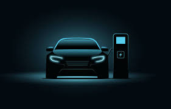

# 16_17_Electric_Vehicles
**
Source: https://ev-database.org/**

# 1- Overview 
In the recent years, the demand for Electric Vehicles(EV) have increased many folds. Electric vehicles are not just good for enviromnet but are also cost effective and offer better driving experience. Furthermore, advancement in battery design and model have increasd the variety of electric vehilcles available to consumers.

# 2- Objectives
We believe that there are numerous factors contributing to popularity of elecric vehicles, with this porject we aim to focus on:
    - Price comparison by Brand
    - Top Speed and Acceleration Analysis 
    - Range and Efficiency Evaluation
    - Drive Configuration Preference
    - Tesla v.s. BYD/Top 10 cars

We aim to present our objectives through different visualizations following the given steps.

# 3- Resource Requirement
    - Installation: Python, Postges SQL
    - Technologies used: Flask, SQLAlchemy, pandas, psycopg2, HTML/CSS, D3.js, JavaScript

# 4- Contributors 
    - Abid Hussain
    - Amer Banaweer
    - Charu Arora
    - Vanilla Tse